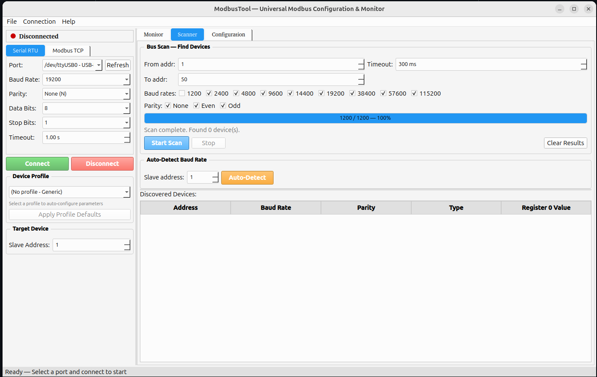

# ModbusTool

> **Linux-only** — Native desktop tool for Modbus RTU/TCP device configuration and monitoring.

Universal Modbus RTU/TCP Configuration & Monitoring Tool for **Linux**, built with Python and PyQt6. Designed and tested on Ubuntu 24.04.

Developed by [Robotika.cloud](https://robotika.cloud/) as part of the [nkz-os.org](https://nkz-os.org) project.



## Features

- **Dashboard** — human-friendly view with large sensor value cards, one-click reading, and auto-polling
- **Serial RTU & TCP/IP** — connect to Modbus devices over USB/RS485 or Ethernet
- **Bus scanner** — scan address ranges across multiple baud rates and parities simultaneously
- **Auto baud rate detection** — automatically finds the correct baud rate and parity for a device
- **Register monitor** — read holding/input registers, coils, and discrete inputs with continuous polling
- **Device configuration** — read/write registers using device profiles with human-readable names
- **Auto-reconnect** — automatically reconnects at the new baud rate after changing communication settings
- **Batch operations** — wizard for assigning unique addresses to multiple identical devices sequentially
- **Profile wizard** — step-by-step GUI to create JSON profiles for new sensors without editing files
- **Raw TX/RX viewer** — inspect Modbus frames in hexadecimal in real-time
- **Data logging & CSV export** — log all readings with timestamps and export to CSV
- **Device profiles** — JSON register maps for known devices, with two bundled profiles

## Supported Function Codes

| Code | Description |
|------|-------------|
| FC01 | Read Coils |
| FC02 | Read Discrete Inputs |
| FC03 | Read Holding Registers |
| FC04 | Read Input Registers |
| FC05 | Write Single Coil |
| FC06 | Write Single Register |
| FC0F | Write Multiple Coils |
| FC10 | Write Multiple Registers |

## Platform

**Linux only.** Tested on Ubuntu 24.04 (should work on any modern Linux distribution with Python 3.10+).

## Requirements

- Linux (Ubuntu 24.04, Debian, Fedora, Arch, etc.)
- Python 3.10+
- USB to RS485 adapter (for serial RTU devices)
- User in the `dialout` group for serial port access (`sudo usermod -aG dialout $USER`)

## Installation

```bash
git clone https://github.com/basabot/modbus-tool.git
cd modbus-tool
pip install -r modbustool/requirements.txt
```

## Usage

```bash
cd modbustool
python3 main.py
```

See [MANUAL.md](MANUAL.md) for a detailed user guide.

### Quick Start

1. **Select a profile** from the left panel (or create one with the wizard)
2. **Click "Apply Defaults"** to set baud rate, parity, and slave address
3. **Connect** to your serial port or TCP target
4. **Go to Dashboard** and click "Read Sensor Data" to see values
5. **Use Configuration tab** to change device address, baud rate, or calibration

## Device Profiles

Profiles are JSON files in `modbustool/profiles/` that define register maps for specific devices. Create new profiles easily with **File > New Profile Wizard** (Ctrl+N).

### Bundled Profiles

| Profile | Device | Default Baud |
|---------|--------|-------------|
| Temperature & Humidity Sensor | Generic RS485 LY485 sensor | 9600 |
| RS-GH-N01-AL | Shandong Renke PAR sensor (400-700nm) | 4800 |

## Project Structure

```
modbustool/
  main.py                    # Entry point
  requirements.txt           # Python dependencies
  core/
    modbus_client.py          # Unified Modbus RTU/TCP client
    scanner.py                # Bus scanning & baud detection (threaded)
    device_profiles.py        # Profile loading, saving & management
  ui/
    main_window.py            # Main application window
    connection_panel.py       # Connection settings & profile selection
    dashboard_tab.py          # Human-friendly sensor dashboard
    monitor_tab.py            # Register monitoring, polling & data log
    scanner_tab.py            # Bus scanner & baud auto-detection
    config_tab.py             # Device configuration & batch operations
    profile_wizard.py         # Step-by-step profile creation wizard
  profiles/
    temp_humidity_sensor.json  # Temperature & humidity sensor profile
    rs_gh_n01_par.json         # PAR radiation sensor profile
```

## Contributing

Contributions are welcome. Please open an issue or pull request at [github.com/nkz-os/nkz-modbus-tool](https://github.com/nkz-os/nkz-modbus-tool).

## License

AGPL-3.0 — see [LICENSE](LICENSE) for details.

## Links

- [Robotika.cloud](https://robotika.cloud/) — Development
- [nkz-os.org](https://nkz-os.org) — Related project
